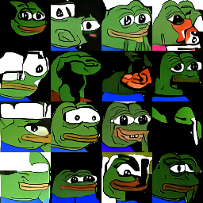

Used repos:
 - https://github.com/openai/improved-diffusion
 - https://github.com/awjuliani/pytorch-diffusion
 - https://github.com/dome272/Diffusion-Models-pytorch

TODOs:
 - log FID,
 - (?) setup hparams logging,
 - try out pepe emoticons from bttv and 7tv,
 - (?) find a way to train on pepe dataset without celeba pretraining,
 - try bigger image size or interpolate (upscale) images to bigger size,
 - try different number of diffusion steps
 - (?) use flash attention,

Modifications:
 - (?) fix distribution during training,
 - conditioning,
 - super resolution model,
 - SDE in diffusion,

Last results:

