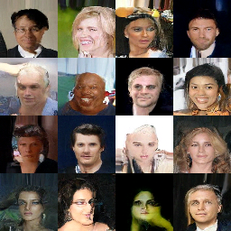

Used repos:
 - https://github.com/openai/improved-diffusion
 - https://github.com/awjuliani/pytorch-diffusion
 - https://github.com/dome272/Diffusion-Models-pytorch

TODOs:
 - log distribution of sampled values and compare it with distribution of train data,
 - log FID,
 - setup hparams logging,
 - find better pepe dataset,
 - train on (new) pepe dataset,
 - try bigger image size or interpolate (upscale) images to bigger size,
 - try different channel_mult ([1, 2, 4, 4], [2, 2, 4, 4], [2, 4, 8, 8]),
 - try lower number of diffusion steps

Modifications:
 - fix distribution during training?
 - conditioning
 - super resolution model
 - SDE in diffusion

Last result: Version 11

