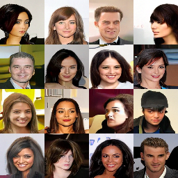

Used papers:
 - https://arxiv.org/abs/2006.11239
 - https://arxiv.org/abs/2011.13456

Used repos:
 - https://github.com/openai/improved-diffusion
 - https://github.com/awjuliani/pytorch-diffusion
 - https://github.com/dome272/Diffusion-Models-pytorch
 - https://github.com/yang-song/score_sde_pytorch

TODOs:
 - (?) setup hparams logging,
 - collect a new Pepe dataset
 - try bigger image size or interpolate (upscale) images to bigger size,
 - (?) use flash attention (https://github.com/Dao-AILab/flash-attention),
 - visualise influence of condition on celeba generation

Modifications:
 - conditioning,
 - super resolution model,
 - SDE in diffusion (https://arxiv.org/pdf/2011.13456.pdf, https://arxiv.org/pdf/2206.00364.pdf),
 - use conditional embedding to apply features from celeba dataset on generated Pepe,

Last results:

Celeba v11: unconditional

Pepe v6: unconditional

